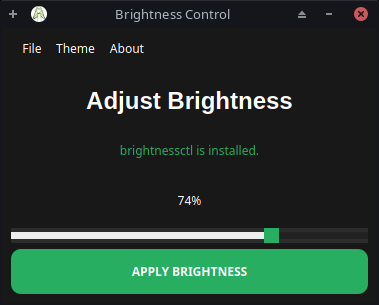

```markdown
<h1 align="center">Brightness Control</h1>
<p align="center">
  
</p>

<p align="center">
  <strong>Simplify Screen Brightness Adjustment with the Brightness Control</strong>
</p>

<p align="center">
  <a href="#features">Features</a> •
  <a href="#getting-started">Getting Started</a> •
  <a href="#usage">Usage</a> •
  <a href="#themes">Themes</a> •
  <a href="#troubleshooting">Troubleshooting</a> •
  <a href="#contributing">Contributing</a> •
  <a href="#license">License</a>
</p>

---

## Features

- **Intuitive Brightness Control:** Elevate your screen experience with a beautifully designed interface, enabling effortless adjustment of brightness levels.

- **Real-Time Feedback:** As you interact with the slider, the application instantly displays the ongoing brightness percentage, aiding precision.

- **Seamless Brightness Application:** One click on the "Apply Brightness" button seamlessly enacts the selected brightness setting, leveraging the powerful `brightnessctl` utility.

- **Personalized Themes:** Embrace your visual preferences by selecting between 4 elegant themes – "Dark", "Blue", "Red" and "Green".

- **Immediate Utility Status:** Stay informed about the `brightnessctl` utility's availability through real-time feedback, ensuring you're always ready to manage brightness.

- **Community Collaboration:** As an open-source project, the app encourages community participation, from suggesting improvements to contributing code.

---

## Getting Started

### Prerequisites

Before using the Brightness Control, make sure you have the following prerequisites installed:

- **Python 3.x:** If not installed, download the latest version from [python.org](https://www.python.org/downloads/).

- **PyQt5:** Install the PyQt5 package using the following command:
  ```sh
  pip install pyqt5
  ```

- **brightnessctl Utility:** This app relies on the `brightnessctl` utility. Install it on Ubuntu/Debian-based systems:
  ```sh
  sudo apt-get install brightnessctl
  ```

### Installation

1. **Clone the Repository:**
   ```sh
   git clone https://github.com/vafaeim/brightness-control.git
   ```

2. **Navigate to the Project Directory:**
   ```sh
   cd brightness-control
   ```

3. **Run the Application:**
   ```sh
   python main.py
   ```

---

## Usage

1. **Launch the Application:**
   The app welcomes you with a beautifully crafted interface, inviting you to take control of your screen's brightness.

2. **Adjust Brightness:**
   - Use the slider to make nuanced brightness adjustments.
   - Witness the real-time brightness preview for accurate fine-tuning.

3. **Apply Brightness:**
   - When satisfied with the desired brightness, a single click on the "Apply Brightness" button effects the change.

---

## Themes

- **Dark Theme:**

  To switch to the dark theme:
  1. Click the "Theme" option in the menu bar.
  2. Select "Dark Theme" from the dropdown.

- **Green Theme:**

  To switch to the green theme:
  1. Click the "Theme" option in the menu bar.
  2. Select "Green Theme" from the dropdown.

- **Blue Theme:**

  To switch to the dark theme:
  1. Click the "Theme" option in the menu bar.
  2. Select "Blue Theme" from the dropdown.

- **Red Theme:**

  To switch to the dark theme:
  1. Click the "Theme" option in the menu bar.
  2. Select "Red Theme" from the dropdown.

---

## Troubleshooting

Encountering issues? Follow these steps to troubleshoot:

- **Check brightnessctl Installation:** Ensure `brightnessctl` is correctly installed and accessible in your terminal.

- **Permissions:** Verify you possess the necessary permissions to adjust brightness. In some scenarios, superuser privileges may be required.

- **Theme Concerns:** If theme-related problems emerge, confirm that the theme stylesheet files (`dark_theme.qss`, `green_theme.qss`, `blue_theme.qss` and `red_theme.qss`) reside alongside `main.py`.

---

## Contributing

Welcome contributions! To enhance the app:

- Submit a pull request for functional improvements or new features.

- Open an issue for bug reports or discussions about enhancements.

---

## License

This project is licensed under the MIT License. For details, refer to the [LICENSE](LICENSE) file.

---

<p align="center">
  Created with ❤️ by Amirreza Vafaei Moghadam
</p>
```
# brightness-control
